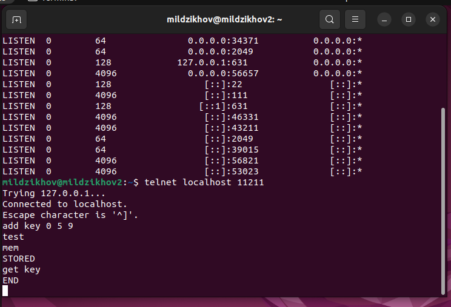
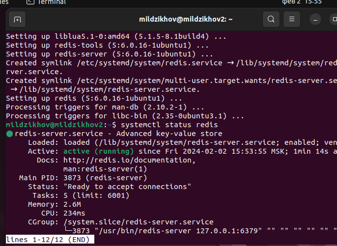
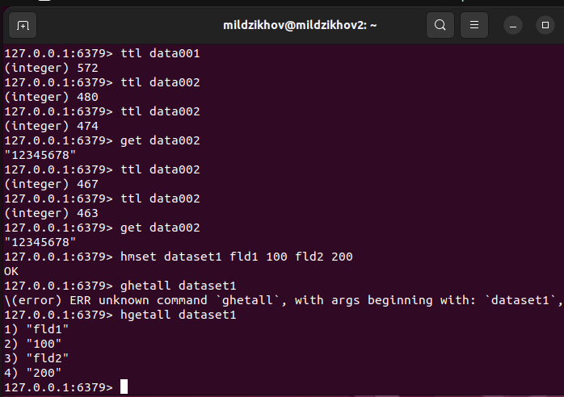

# Домашнее задание к занятию "Кеширование Redis/memcached" - `Мильдзихов Сергей`


   
---

### Задание 1. Кэширование.

Приведите примеры проблем, которые может решить кеширование.


### Ответ
Кеширование может решать следующие проблемы:

1. Замедление работы приложения.

   При работе с базой данных или другими ресурсами, которые требуют длительного времени на обработку запросов, кеширование может значительно ускорить работу приложения, так как запросы будут выполняться быстрее благодаря использованию кеша.

2. Высокая нагрузка на сервер.

    Если множество пользователей одновременно обращаются к серверу, это может привести к перегрузке сервера и замедлению работы приложения. Кеширование позволяет снизить нагрузку на сервер, так как запросы будут выполняться не на сервере, а в кеше.

3. Большой объем данных.

    Кеширование позволяет ускорить работу приложения, так как данные будут храниться в кеше и запросы будут выполняться быстрее.

4. Ограниченный доступ к ресурсам
   
   Кеширование может помочь уменьшить количество запросов к ресурсу, так как данные будут храниться в кеше и не будет необходимости каждый раз обращаться к ресурсу.

6. Низкая скорость соединения.
   
   Низкая скорость соединения может привести к замедлению работы приложения. Кеширование позволяет ускорить работу приложения, так как данные будут храниться локально и запросы будут выполняться быстрее.

### Задание 2. Memcached

Установите и запустите memcached.

### Ответ

```
apt install memcached
systemctl status memcached
```


### Задание 3. Удаление по TTL в Memcached

Запишите в memcached несколько ключей с любыми именами и значениями, для которых выставлен TTL 5.

### Ответ



### Задание 4

Запишите в Redis несколько ключей с любыми именами и значениями.


### Ответ




